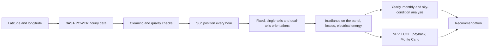

# ☀️ Solar Tracker Selector

### Which solar panel setup is best for your location: fixed, single-axis or dual-axis?

[](https://your-app-name.streamlit.app)


Solar trackers follow the sun and produce more energy, but they cost more and need more maintenance. Whether they are **worth it** depends on the local climate and on costs. This app answers that question for **any latitude and longitude on Earth**.

Enter a location, and the app downloads years of hourly NASA weather data, simulates three panel arrangements hour by hour, tests how reliable the result is, adds a lifecycle cost analysis, and **recommends the best option**.

> **Live app:** (https://solar-tracker-selector.streamlit.app/)

---

## ✨ What it does

| | |
|---|---|
| 📍 **Any location** | Type a latitude and longitude. Hourly irradiance, temperature and wind come from NASA POWER automatically (or upload your own NASA CSV). |
| 🔁 **Multi-year simulation** | Uses up to 25 years of data (default: the last 11 complete years), so results show an average **and** a spread, not one lucky or unlucky year. |
| ⚖️ **A fair comparison** | The fixed panel is **tilt-optimised automatically**, so a tracker is only credited with gains over the *best* fixed panel. |
| 🔬 **Realistic physics** | Transposition models, glass-reflection (angle-of-incidence) losses, cell temperature, system losses, and the tracker's own motor energy. |
| 🌥️ **Explains the "why"** | Shows how tracker gain changes by month, by year, by sky condition (clear vs overcast) and with the diffuse fraction of light. |
| 💰 **Lifecycle economics** | NPV, LCOE, simple and discounted payback, degradation, O&M growth and motor replacement over the project lifetime. |
| 🎲 **Robustness check** | 4,000 random scenarios (tariff, costs, discount rate, degradation, model uncertainty) show how often each option wins. |
| ✅ **A clear recommendation** | Pick the criterion (lifetime value, cost of energy, or energy yield) and get a recommended option with a plain-language explanation and a "close call" warning when the answer is sensitive to assumptions. |
| 📤 **Export** | Download all tables to Excel and a summary report as Markdown. |

## 🧭 How it works



**The three configurations**

| Configuration | Motion | Typical use |
|---|---|---|
| **Fixed** | None, at the optimised tilt | Simplest and cheapest |
| **Single-axis** | Rotates east-west about a horizontal north-south axis (default limit ±60°) | The mainstream tracker |
| **Dual-axis** | Always points at the sun | Highest energy, highest cost and complexity |

## 🖥️ What you see in the app

After pressing **Run analysis**, the results page shows a recommendation banner and scorecard, then these tabs:

1. **Energy by year**: annual yield per configuration, spread across years, P50/P90, and tracker gain for each year.
2. **Months and seasons**: monthly yield, monthly tracker gain, and a year-by-month heat map.
3. **Why trackers help**: gain versus diffuse fraction, gain by sky condition, and sunniest/cloudiest day profiles.
4. **Sensitivity**: fixed-tilt sweep, rotation-limit study, transposition-model comparison, glass-reflection effect and time-alignment check.
5. **Economics**: NPV/LCOE/payback table, break-even heat maps, and Monte Carlo results.
6. **Data and validation**: data coverage by year, daily profile, timestamp alignment test, and a PVGIS comparison.
7. **Export**: Excel workbook and Markdown report.

## 📊 Example result (Colombo, Sri Lanka, 2025 NASA POWER data)

| | Fixed (best tilt ≈ 5°) | Single-axis | Dual-axis |
|---|---|---|---|
| Annual energy (kWh per kWp) | ≈ 1,460 | ≈ 1,700 | ≈ 1,740 |
| Gain over fixed | n/a | ≈ +16% | ≈ +19% |

Near the equator, one tracking axis captures most of the available gain and the second axis adds little. Whether the extra energy justifies the extra cost depends on the electricity value and the tracker price, which is what the economics tab and the break-even heat maps are for.

## 🚀 Quick start

```bash
python -m venv solar-env
solar-env\Scripts\activate          # Windows   (macOS/Linux: source solar-env/bin/activate)
pip install -r requirements.txt
streamlit run app.py
```

The app opens in your browser. Enter the coordinates in the sidebar and press **Run analysis**.

Requires **Python 3.10 or newer** and an internet connection for the automatic NASA download.

## 🗂️ Files

| File | Purpose |
|---|---|
| `app.py` | The web interface (Streamlit): inputs, results and charts |
| `engine.py` | All calculations: data download and cleaning, simulation, statistics, sensitivity, economics |
| `requirements.txt` | Python libraries |

## 📥 Data

* **Automatic:** NASA POWER hourly API (`ALLSKY_SFC_SW_DWN`, `_DNI`, `_DIFF`, `T2M`, `WS10M`), requested in **UTC**, one year per request.
* **Upload:** a CSV with either one time column `t` plus `DNI, DHI, GHI, Tair`, or the native NASA layout with `YEAR, MO, DY, HR`. Choose the time standard of the file in the sidebar. NASA's default download uses local solar time (UTC + round(longitude / 15)).
* **Quality control:** years with less than 95% valid hours are excluded, gaps of up to 3 hours are interpolated, and a timestamp-alignment check compares the data's GHI, DNI and DHI against the sun's position.

## 🧮 Methods in brief

| Step | Method |
|---|---|
| Sun position | pvlib solar position, evaluated at mid-hour |
| Plane-of-array irradiance | Transposition model (Hay-Davies by default; Reindl, Klucher, isotropic available) |
| Glass reflection | Physical angle-of-incidence model on the direct beam |
| Cell temperature | Faiman model, with wind speed from NASA when available |
| DC power | PVWatts model with temperature coefficient and system losses |
| Single-axis motion | pvlib single-axis tracking geometry, horizontal north-south axis |
| Economics | Discounted cash flow: NPV, LCOE, payback, with degradation, O&M escalation and motor replacement |
| Robustness | Monte Carlo over cost, tariff, discount-rate, degradation and model-uncertainty ranges |

## 💡 How the recommendation is made

You choose the criterion: **lifetime value (NPV)**, **lowest cost of energy (LCOE)**, or **maximum energy yield**. The app names the best option, reports the share of random scenarios in which each option wins, and warns when the result is a **close call**.

> ⚠️ **All cost inputs in the app are placeholders.** Replace them with real quotes and your actual electricity value before relying on the economic result. The energy results do not depend on them.

## ☁️ Deploy it yourself (free)

1. Put `app.py`, `engine.py`, `requirements.txt` and `README.md` in a public GitHub repository.
2. Sign in at [share.streamlit.io](https://share.streamlit.io) with GitHub.
3. Click **Create app**, choose your repository, branch `main`, and main file `app.py`, then deploy.

## ⚠️ Limitations

* Single-axis means a **horizontal north-south axis** with east-west rotation. A tilted axis suits high latitudes better.
* **One row** of panels: no row-to-row shading or backtracking, and no land-use cost.
* NASA POWER is satellite/reanalysis data with coarse resolution (roughly 50 km). **Validate against PVGIS or measurements.**
* Hourly averages hide short-term cloud variability. Spectral effects, soiling and inverter limits are simplified.
* Hourly values are treated as hour-beginning averages (sun evaluated at mid-hour by default). The Data tab includes a time-stamp alignment check, and the Sensitivity tab shows how much the offset matters.
* Economic results depend on user-supplied costs and tariffs.

## 🙏 Acknowledgements

* [NASA POWER](https://power.larc.nasa.gov/): weather and solar resource data
* [pvlib python](https://pvlib-python.readthedocs.io/): solar position, irradiance and PV models
* [Streamlit](https://streamlit.io/): the web interface
* [PVGIS](https://re.jrc.ec.europa.eu/pvg_tools/) (European Commission): independent validation

## 👤 Author

H. Premal Adrian Silva · Electrical and Electronic Engineering · University of Sri Jayewardenepura
